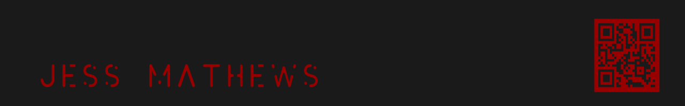

<h1 align="center">Hi , I'm Jess!</h1>

 
<h2 align="center">Student ✨</h2>

 
 

- 🔭 I’m currently working on building something that can change **everything**

- 🌱 I’m currently learning **Data Structures** and **Algorithms**

- 👯 I’m looking to collaborate on **anything that can be a learning experience**

 
 

<h2 align="left">Connect:</h2>

  

 
 

<h2 align="left">Stats:</h3>
 

<!--### Hi there 👋
**jessmathews/jessmathews** is a ✨ _special_ ✨ repository because its `README.md` (this file) appears on your GitHub profile.

Here are some ideas to get you started:

- 🔭 I’m currently working on ...
- 🌱 I’m currently learning ...
- 👯 I’m looking to collaborate on ...
- 🤔 I’m looking for help with ...
- 💬 Ask me about ...
- 📫 How to reach me: ...
- 😄 Pronouns: ...
- ⚡ Fun fact: ...
-->
